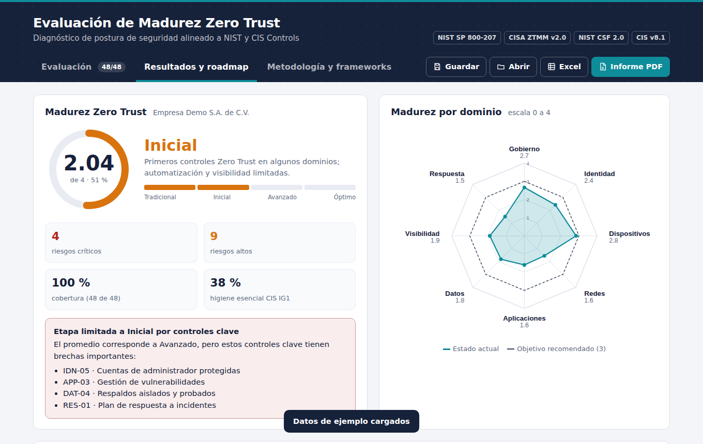
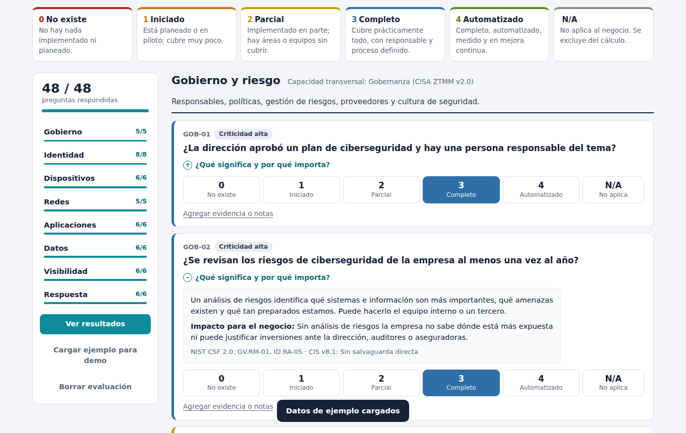
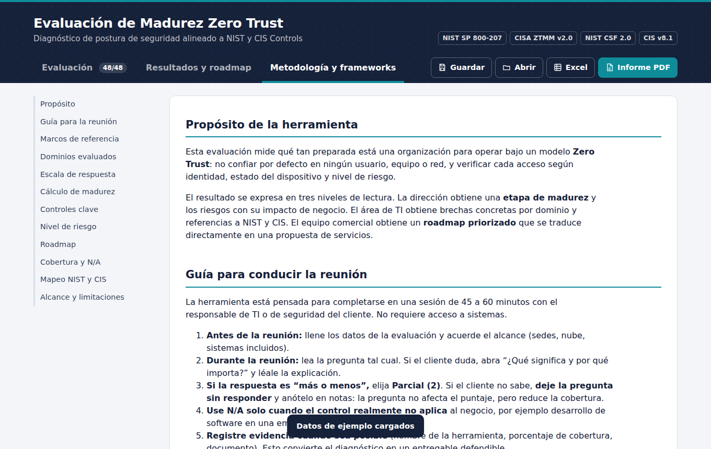
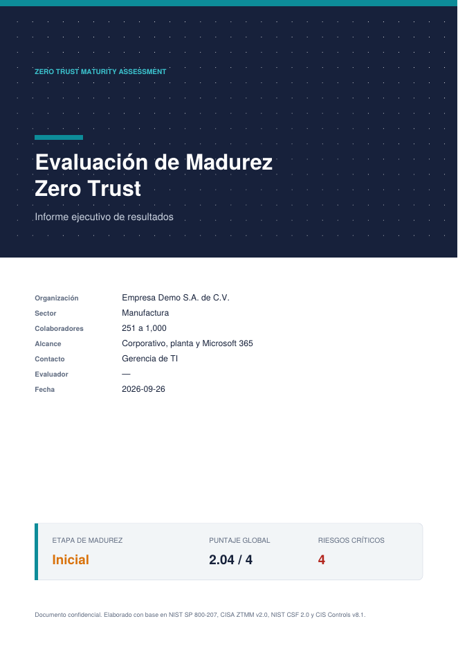

# Zero Trust Maturity Assessment

Herramienta web de código abierto para evaluar la **madurez Zero Trust** de una organización mediante una entrevista guiada de 48 preguntas. Genera una etapa de madurez, riesgos con impacto de negocio y un roadmap priorizado. Cada control está mapeado a **NIST CSF 2.0** y **CIS Controls v8.1**.

Es un solo archivo HTML: no requiere instalación, servidor ni conexión a Internet.

## Características

- **8 dominios** basados en CISA Zero Trust Maturity Model v2.0: Gobierno, Identidad, Dispositivos, Redes, Aplicaciones, Datos, Visibilidad y Respuesta.
- **48 preguntas en lenguaje de negocio**, pensadas para usarse con equipos comerciales. Cada una incluye una explicación y su impacto de negocio.
- **Ponderación por criticidad** (Clave, Alta, Media) y **límite de etapa**: si falla un control clave, la etapa global no puede superar *Inicial*.
- **Opción N/A e indicador de cobertura**. Las preguntas sin responder no cuentan como cero.
- **Matriz de riesgo** (Crítico, Alto, Medio, Bajo) con impacto de negocio y recomendación accionable por control.
- **Roadmap dinámico** en cuatro horizontes (0–3, 3–6, 6–12 y más de 12 meses), generado solo con las brechas detectadas.
- **Madurez por función NIST CSF 2.0** (GV, ID, PR, DE, RS, RC) e indicador de **higiene esencial CIS IG1**.
- **Campos de evidencia y notas** por control, para que el resultado sea trazable.
- **Exportación** a informe PDF ejecutivo (con texto seleccionable), Excel de 5 hojas y JSON para guardar y retomar una evaluación.
- **Pestaña de metodología** con los marcos de referencia, fórmulas, tabla de mapeo completa y una guía para conducir la reunión.
- Diseño adaptable a móvil, con modo oscuro y navegación por teclado.

## Uso

1. Descarga `index.html` y ábrelo en Chrome, Edge o Firefox.
2. Completa los datos de la organización y responde las preguntas (0 No existe · 1 Iniciado · 2 Parcial · 3 Completo · 4 Automatizado · N/A).
3. Revisa la pestaña **Resultados y roadmap** y exporta el informe.

Para presentar la herramienta sin datos reales, usa **Cargar ejemplo para demo**.

También se puede publicar directamente con **GitHub Pages**: en *Settings → Pages*, selecciona la rama `main` y la carpeta raíz.

## Modelo de evaluación

| Elemento | Regla |
|---|---|
| Puntaje por dominio | Promedio ponderado: Σ(peso × respuesta) ÷ Σ(peso). Pesos: Clave 3, Alta 2, Media 1 |
| Puntaje global | Promedio de los dominios evaluados (todos pesan igual) |
| Etapas (CISA ZTMM) | Tradicional < 1 ≤ Inicial < 2 ≤ Avanzado < 3 ≤ Óptimo |
| Límite por controles clave | Si un control clave obtiene 0 o 1, la etapa máxima es Inicial |
| Riesgo | Controles por debajo de 3. Clave: Crítico o Alto · Alta: Alto o Medio · Media: Medio o Bajo |
| Cobertura | Respondidas + N/A ÷ 48. Por debajo del 80 % el resultado es preliminar |

## Marcos de referencia

- NIST SP 800-207 — Zero Trust Architecture
- CISA Zero Trust Maturity Model v2.0
- NIST Cybersecurity Framework 2.0
- CIS Critical Security Controls v8.1

El mapeo de preguntas a subcategorías y salvaguardas es orientativo. Para auditorías formales, valídalo contra los documentos oficiales.

## Personalización

Todo está en `index.html`:

- **Preguntas y mapeo:** arreglos `DOMAINS` y `QUESTIONS` dentro del bloque `<script>` final. Cada pregunta define su texto, explicación, impacto, recomendación, peso (`w`), esfuerzo (`e`), `nist` y `cis`.
- **Colores:** variables CSS en `:root` (`--accent`, `--ink`, `--hdr`, etc.), incluidas las del modo oscuro.
- **Reglas de riesgo y horizontes:** constantes `STAGES`, `RISK` y función `riskLevel()`.

## Privacidad

La información se guarda únicamente en el navegador (`localStorage`) y en los archivos que exportes. La herramienta no envía datos a ningún servidor. Las librerías de exportación ([jsPDF](https://github.com/parallax/jsPDF), [jsPDF-AutoTable](https://github.com/simonbengtsson/jsPDF-AutoTable) y [SheetJS](https://sheetjs.com), bajo licencias MIT y Apache 2.0) van incluidas dentro del archivo.

No publiques evaluaciones reales de organizaciones en el repositorio.

## Limitaciones

Es un diagnóstico basado en entrevista. No sustituye una auditoría técnica, pruebas de penetración ni una certificación.

## Capturas

| Evaluación | Metodología | Informe PDF |
|---|---|---|
|  |  |  |

## Autor

Elaborado por **Ing. Ronald Vera Paz** · [github.com/ronaldvp](https://github.com/ronaldvp)

## Licencia

[MIT](LICENSE)
